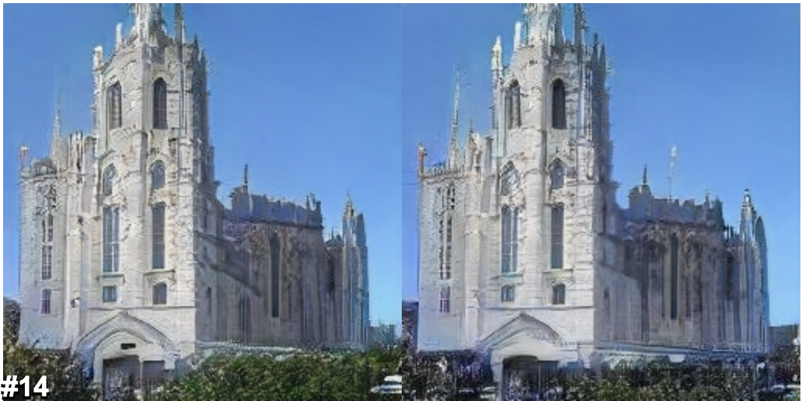
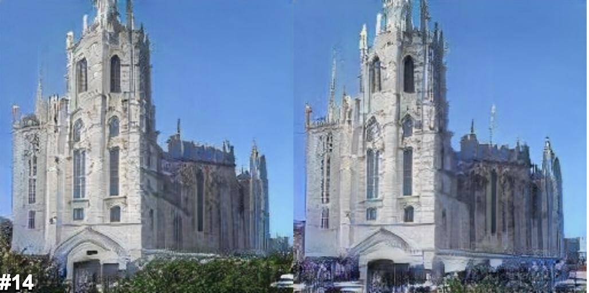
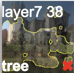

# 2019CVFX_Homework3_Team5

## Generate Image with GANPaint

#### 1. 在照片中新增樹
首先我們試著在天空中畫上樹，可以看到，可以成功的在房子旁邊畫上樹，並且就整體畫面來說還算合理。 

不過我們發現在有些圖片中，如果在天空的地方畫樹也會成功畫上去，得到漂浮在天空中的樹 

 
不過經過我們都次嘗試後發現，想在天空中畫上樹，要畫在天空的邊邊，這樣才能成功。我們認為這是因為有些照片再取景的時候會有那種周圍有樹遮蔽的效果（從樹叢中拍出去的感覺），所以這種情況下數出現在「天空」中市合理的。

#### 2. 在照片中加上草、移除屋頂

我們也嘗試在照片中的房子牆面加上草，發現是加的上去的，而且出來的效果很像物理館（？）的感覺。他的草不會是長滿我們所有畫的地方，有好好地避開窗戶的部分。 

另外我們也嘗試移除房子的屋頂，發現無法移除，我們覺得是因為房子一定要有屋頂，所以 GAN 在生成的時候會自懂修復這部分。
 

## Dissect GAN Model

## Compare with other method

### 1. Globally and Locally Consistent Image Completion

這個方法可以應用在不歸則形狀的補全、物件移除，並且補全的東西可能不曾出現在圖片上（代表並非直接從圖片中找到相似區域去補全）。 
而這個方法主要分為三個架構： Completion Network、Global context discriminator、Local context discrminator。

#### A. Completion Network
Completion Network 主要的架構為 Fully Convolution network。為了讓除了需要修補的區域之外的圖片可以不會失真，產生之後會將除了修補區域以外的 RGB 值設回原值。

#### B. Global context discriminator
Global context discriminator 的 input 為整張圖片，用來分辨產生的整張圖片的真實性。

#### C. Local context discriminator
不同於 Global context discriminator，Local context discrminator 的 input 為以修補區塊為中心的局部圖片（128*128大小）。利用兩個 discrminator 的 output 結合來判斷所生成的圖片是否真實，這樣可以更加的顧及到大範圍以及小範圍圖片的合理、真實性，結果也會更加準確。
 
 

效果上在移除物的部分也蠻不錯的，如下圖

 
下圖為挖空教堂左下角門、窗戶以及部分牆壁的結果，由於我們使用的這個pre-trained model適用於戶外自然風景，因此我們可以看到這個方法應用在修補建築物上結果看起來較為模糊，隱約可以看到窗戶的輪廓，但細節比較不清晰，在門的部分看起來也是稍微突兀。而跟GAN Paint移除門的結果比較，GAN Paint如上述在training時，會學習到自動一個建築物應該要有門這個結構，因此即使移除了門，仍會補上另一種看起來合理的門。

 
下圖為應用到修補屋頂的部分，也會有上述的問題，因此結果看起來不太合理，若是用GAN Paint移除屋頂的話，則是跟原圖差異沒有太大。

 
而下圖我們針對樹進行移除修補的部分，則可以看到效果便相當合理。在GAN Paint移除樹的部分，畫面也算是和諧。

 
這個方法在較有挑戰性的人臉修補（face completion）也相當有突破，例如眼睛、鼻子、嘴巴等都可以達到非常逼真的修補，不過這次使用的pre-trained model比較適用於自然風景的圖片。

### 2. Image Outpainting
[這個方法](https://github.com/bendangnuksung/Image-OutPainting)是 Stanford 大學所發表的，他可以透過 input 圖片的中心，進而向左右去擴展圖片，得到更大張的圖。 
他的架構如下 

 
主要是參考 DCGAN 的架構，與上面的 Globally and Locally Consistent Image Completion 這個方法相似。他的 model input 為 128*128 的圖片，故 dataset 中的圖([3500 scrapped beach data](https://drive.google.com/file/d/1hKIn-Z8Uf3voESbJZVsapLHESPabjjrb/view))須先經過 preprocessing

#### Data pre-processing
先將 image down-sampling 成 128 * 128，並把他 normalize 到 [0,1]，得到 In。接著計算 In 的 mean pixel intensity 以及 Mask，利用他們與 In 計算得到 Ip。

#### Generator
Generator 的架構為 8 層的 convolution layer，並在倒數第二層中插入一層 deconvolution layer。利用 Datapreprocessing 中的 Ip 當作 input 生成最後的 output Io

#### Discrminator
Discriminator 在這篇中也運用了上一個方法中的 global+local 的概念，用來分辨 Io 以及 In。使用了 local discrminator 可以使生成後的圖片兩側比較不會有一條條的紋路，畫面看起來會比較平滑。

#### 效果
以下為我們的結果

生成的圖片外圍的部分看起來雖然很模糊，但在色彩邊緣延續的部分看起來是合理的，海岸線的部分也有好好的連結。像是左圖那張夕陽照，在雲層，海洋的部分的顏色都有很好的延續，如果不要靠太近（？）看，整張圖看起來是合理的，不會有很突兀的感覺。
  
運用在 ganpaint 的塗上效果沒有很好，這是因為我們 training 的 dataset 是海灘的 dataset 並非 building，不過還是看得出他有照邊界的部分去做延伸

## 結論
