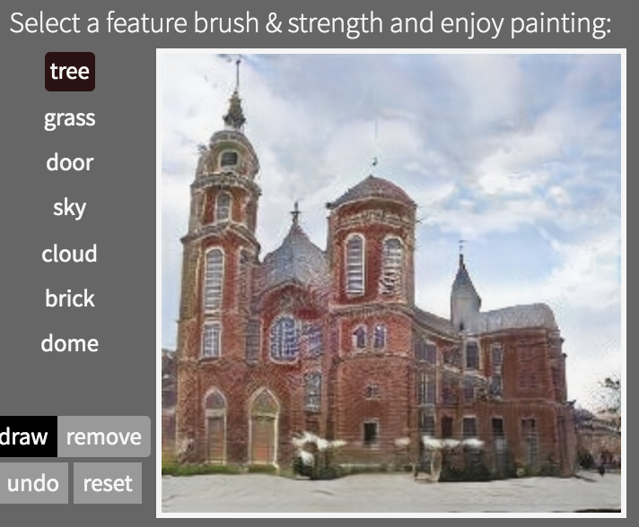
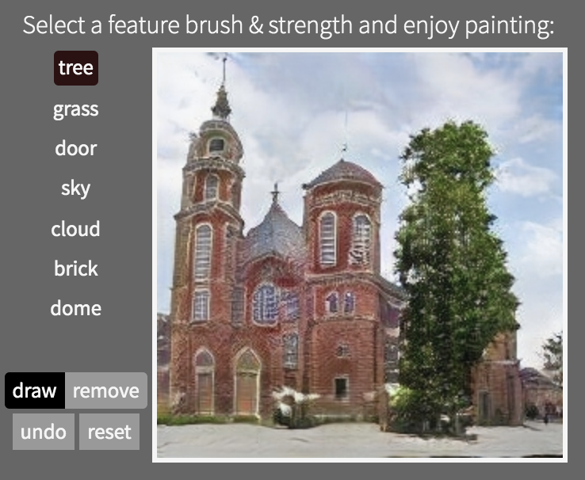
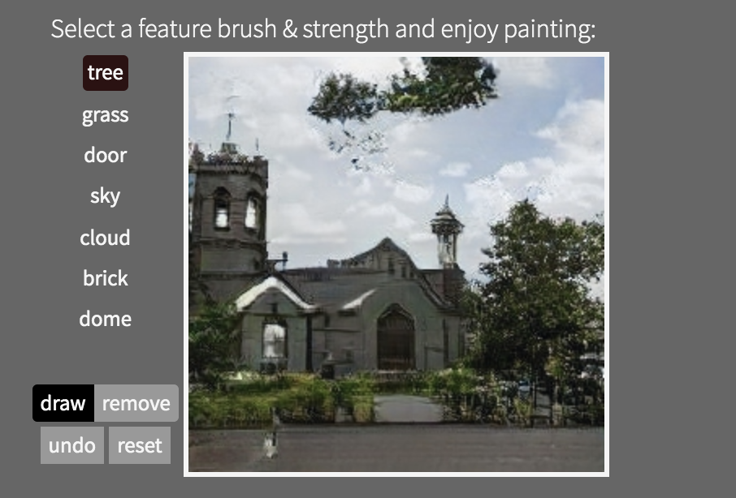
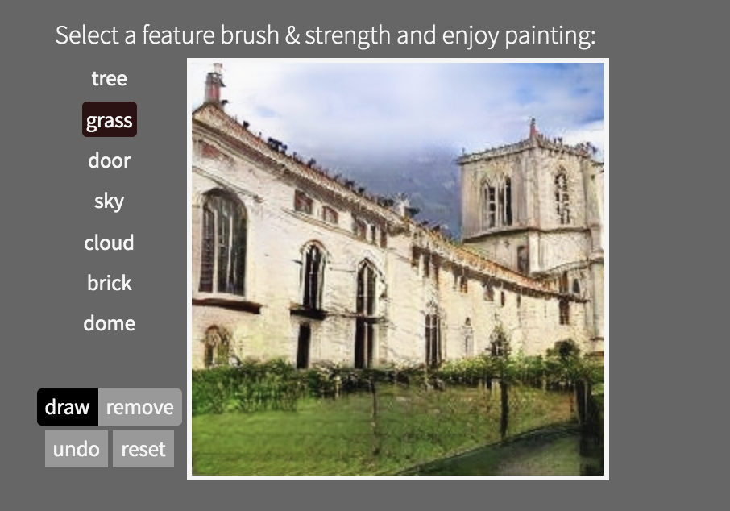
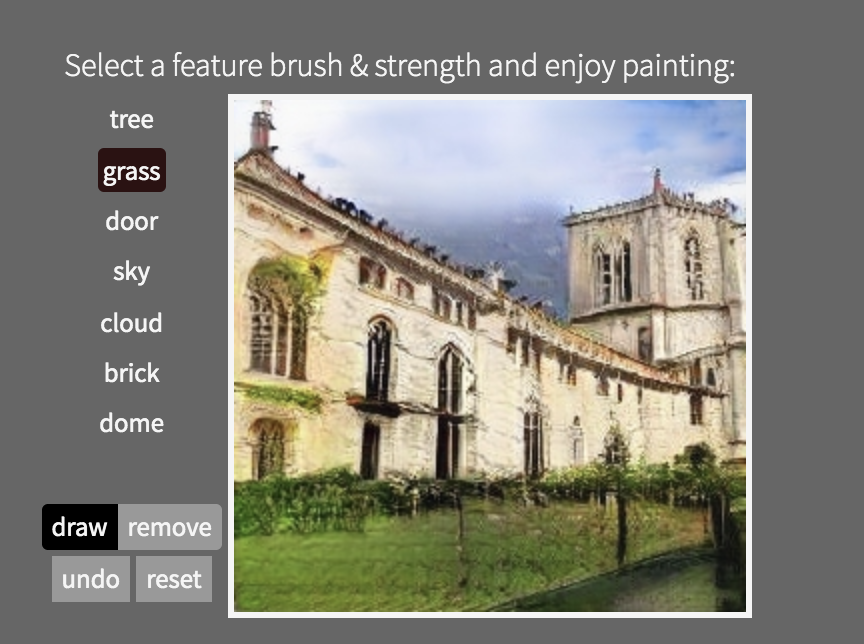
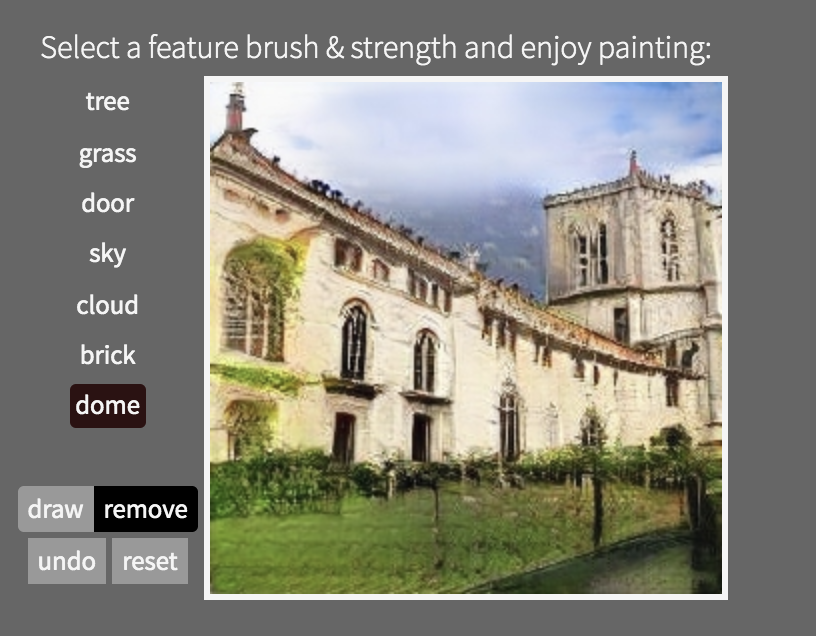
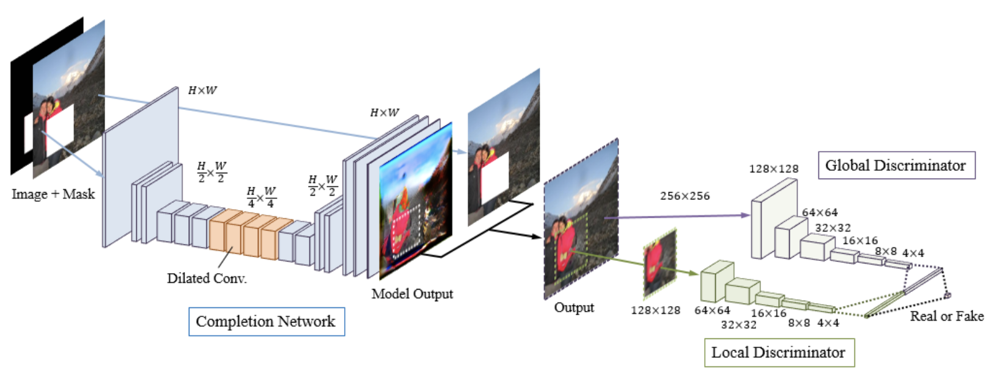

# 2019CVFX_Homework3_Team5

## Generate Image with GANPaint

#### 1. 在照片中新增樹
首先我們試著在天空中畫上樹，可以看到，可以成功的在房子旁邊畫上樹，並且就整體畫面來說還算合理。 

 
不過我們發現在有些圖片中，如果在天空的地方畫樹也會成功畫上去，得到漂浮在天空中的樹 

 
不過經過我們都次嘗試後發現，想在天空中畫上樹，要畫在天空的邊邊，這樣才能成功。我們認為這是因為有些照片再取景的時候會有那種周圍有樹遮蔽的效果（從樹叢中拍出去的感覺），所以這種情況下數出現在「天空」中市合理的。

#### 2. 在照片中加上草、移除屋頂

我們也嘗試在照片中的房子牆面加上草，發現是加的上去的，而且出來的效果很像物理館（？）的感覺。他的草不會是長滿我們所有畫的地方，有好好地避開窗戶的部分。 

另外我們也嘗試移除房子的屋頂，發現無法移除，我們覺得是因為房子一定要有屋頂，所以 GAN 在生成的時候會自懂修復這部分。
 

## Dissect GAN Model

## Compare with other method

### 1. Globally and Locally Consistent Image Completion

這個方法可以應用在不歸則形狀的補全、物件移除，並且補全的東西可能不曾出現在圖片上（代表並非直接從圖片中找到相似區域去補全）。 
而這個方法主要分為三個架構： Completion Network、Global context discriminator、Local context discrminator。
#### A. Completion Network:
